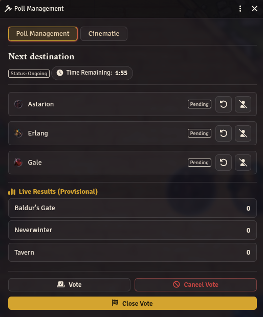
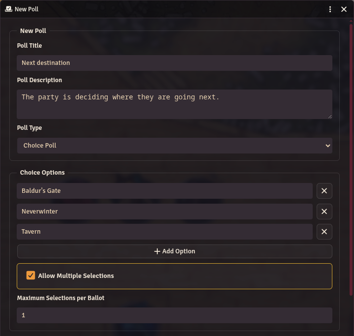
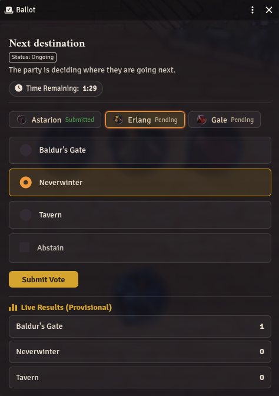
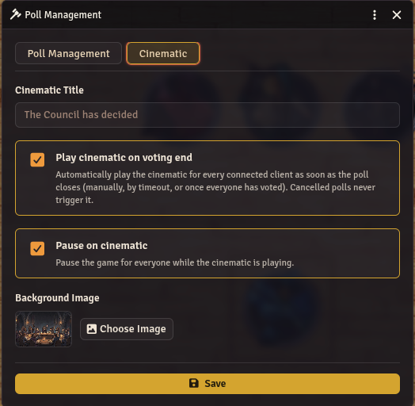
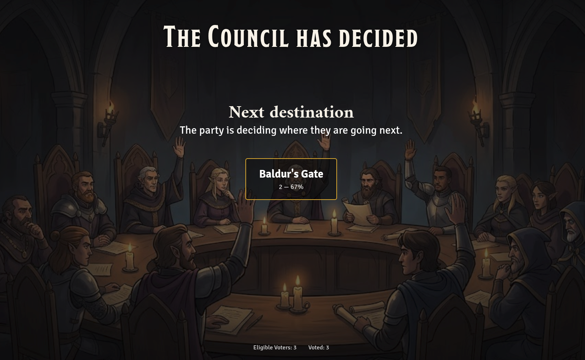
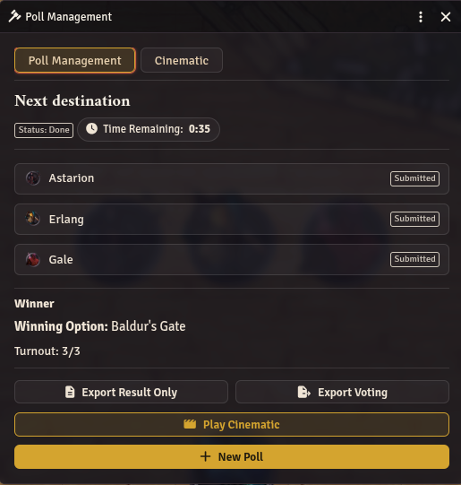
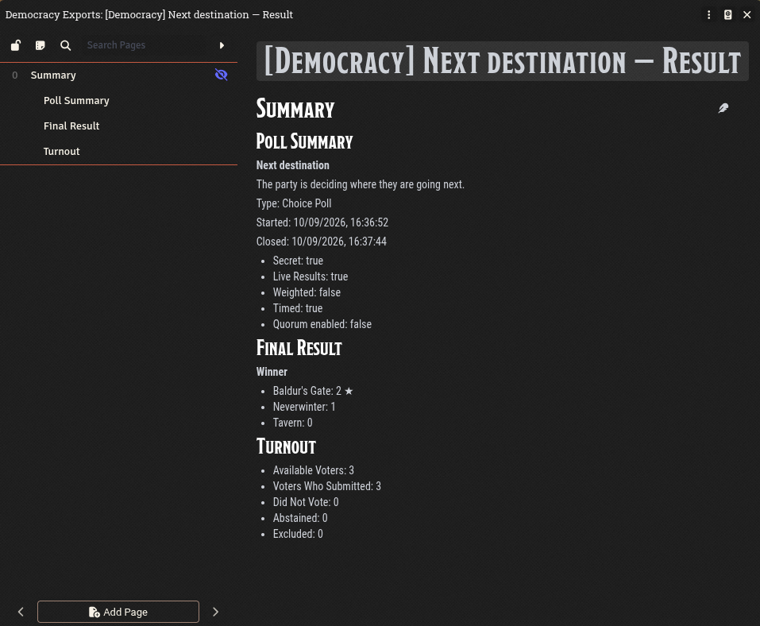
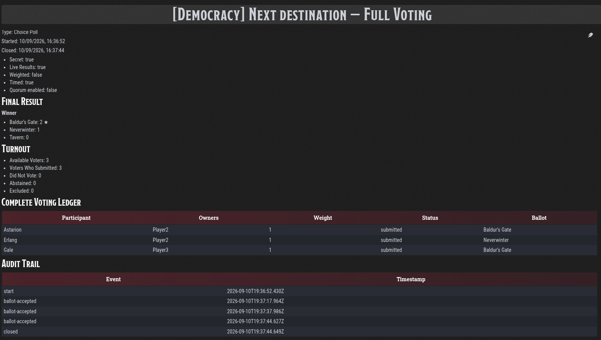

# Democracy

A Foundry VTT (v14) module for running real votes at the table — **Proposal** votes and **Choice** polls, cast token-by-token, with secret or live results, weighted votes, timers, quorum, exact majority rules, a cinematic result reveal, and GM-only Journal exports. System-independent.



## Features

- **Two poll types** — a Proposal vote (Approve / Disapprove / Abstain / Follow Majority, with six exact majority rules including Supermajority) or a Choice poll (single or multiple selections, ties reported honestly as a tie).
- **Token-based ballots** — every participant is a scene token, not a player account. NPCs vote too (as the GM), a player can hold several tokens and switch between them, and the GM can cast an override ballot for a player-owned token with a confirmation prompt logged to the audit trail.
- **Secret Vote & Live Results** — hide ballot choices from chat, the results screen, and Journal exports, or show a running aggregate tally while the poll is still open.
- **Weighted & Timed voting** — give participants a configurable vote weight instead of one vote each, and/or close the poll automatically at a fixed deadline.
- **Quorum** — require a minimum turnout percentage before a poll is allowed to produce an outcome.
- **Cinematic result reveal** — a full-screen, staged fade-in sequence (title → background → poll title/description → framed result) plays for every connected client when a poll ends, with a configurable title, background image, autoplay, and game-pause.
- **GM-only Journal exports** — a readable "Result Only" summary or a "Full Voting" ledger with the complete audit trail, exported as a private JournalEntry only the GM can open.

## Installation

In Foundry's **Add-on Modules** tab, use **Install Module** and paste this manifest URL:

```
https://github.com/Breezeblocksgs/Democracy/releases/latest/download/module.json
```

Then enable **Democracy** in your world's module list.

## Usage

**Starting a poll**
Click the Democracy tool in the Token Controls (GM only). With no poll active this opens the builder: set a title, description, and poll type, pick participant tokens from the current scene, and configure Poll Settings (Secret Vote, Live Results, Weighted Vote, Timed Vote, Quorum) before starting the vote.



**Casting a ballot**
Players click the Democracy tool (or the "Open Vote" chat button) to open their Ballot. Each eligible token they own gets its own tab; they select a choice or option(s) and submit. The GM reaches the same Ballot screen with a **Vote** button in Poll Management, to vote on behalf of NPCs or, with confirmation, a player-owned token that hasn't voted yet.



**Managing a poll**
Poll Management shows every participant's status, live results (if enabled), a countdown (if timed), and lets the GM reset a ballot, exclude a participant, close the vote, or cancel it outright.

**The Cinematic**
Configure the reveal from the **Cinematic** tab in Poll Management — title, autoplay on voting end, whether to pause the game while it plays, and the background image. Play it manually from Poll Management or the GM-only chat button, or let it fire automatically when the poll closes.





Once closed, the result screen shows the winning option (or the approved/rejected proposal outcome) and turnout, with buttons to export the result, play the cinematic, or start the next poll.



**Exporting results**
From a closed poll, **Export Result Only** creates a GM-only Journal entry with the aggregate outcome and turnout; **Export Voting** additionally includes the complete voting ledger and audit trail. Both are idempotent — re-exporting the same poll updates the existing entry instead of duplicating it.





## Known limitation: Secret Vote

Verified live against Foundry v14 Build 367: Foundry's core Document sync sends full plaintext to every connected client's browser memory regardless of Document ownership or `ChatMessage` whisper targeting. Restricting a Document's ownership, or whispering a chat message to the GM only, correctly hides the content from the rendered UI — but the underlying data is still present in that player's browser and readable via the developer console or a rogue module. This is an architectural property of Foundry's client sync, not a bug in this module, and is reproducible with plain core Documents.

**Consequence:** Secret Vote hides a ballot from chat, the Journal sidebar, and the results screen — from casual observation and every in-product surface — but it is **not** confidential against a player using their browser's developer console. There is no fix available within Foundry's constraints (no external backend, no cryptography). Tell your players about this limitation before a "secret" vote if that distinction matters at your table.

## Compatibility

- **Foundry VTT**: v14 (verified against Build 367).
- **Game system**: none required — pure token/User APIs, no system-specific data.
- No dependencies, no bundler — plain ES modules.

## Support

- Issues and bug reports: [GitHub Issues](https://github.com/Breezeblocksgs/Democracy/issues)
